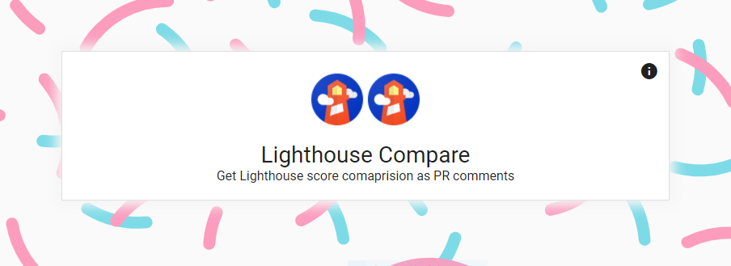
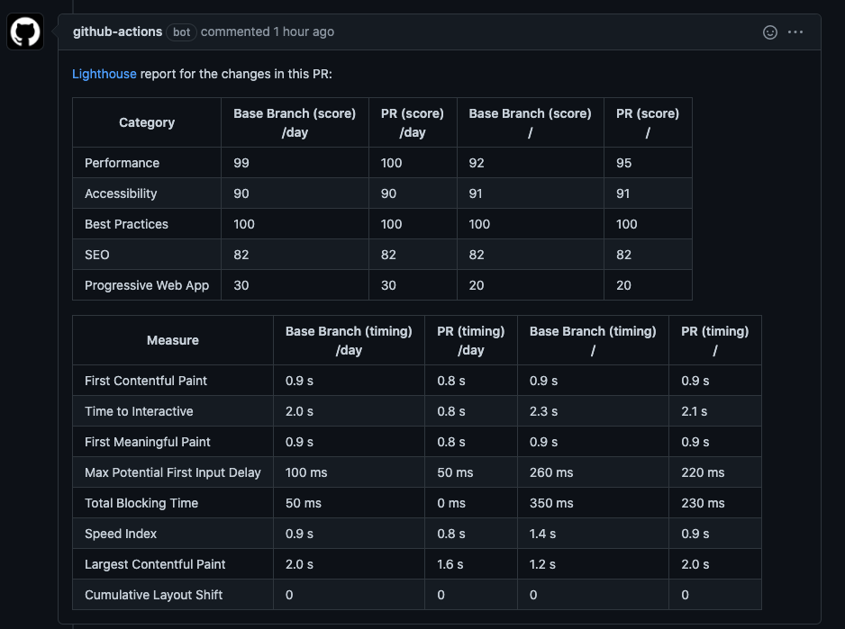

# Create a Lighthouse Compare Action

Use this action to compare lighthouse results between base branch(master/main) and triggered branch



## Features
- ✅ Collect data from lhci server
- 😻 See both results compared in comments
- ⚙️ Link it on your server where `lighthouse-server` is running


## Quick Start
- Copy the token provided on the authorization confirmation page and add it to your secret `githubToken`
- Add the server url where the lhci server is running to `lhciServerURL`
- Add `baseBranch` if your default branch is not master (default branch against which your PR should be compared)
- Enjoy as the it gets the results for you ! 🕵️ 


## Inputs
`token`
github token to make comment from which PR was raised
`lhciServerURL`
URL where lighthouse server is deployed
`baseBranch`
if you use non `master` branch, pass it here

## Usage

How to consume:
If this is your first time working with github actions, then use the below example.
If you have already worked on it, go for 2nd code snippet

```yaml
jobs:
  lighthouse-audit:
    runs-on: ubuntu-latest
    steps:
      - uses: actions/checkout@v2
      - name: Compare lighthouse data
        uses: mdsadiq/lighthouse-compare@v1.2.0
        with:
          lhciServerURL: https://example.com
          githubToken: ${{ secret.LH_COMPARE_GITHUB_APP_TOKEN }}
```

```yaml
    uses: mdsadiq/lighthouse-compare@v1.2.0
    with:
      lhciServerURL: https://example.com
      githubToken: ${{ secret.LH_COMPARE_GITHUB_APP_TOKEN }}
```

## Screenshot of comment created for 2 url [ '/', '/day' ] against master branch


## ROADMAP

  [x] support comparing more than one URL
  [] support lhci servers that are protected behind authentication
